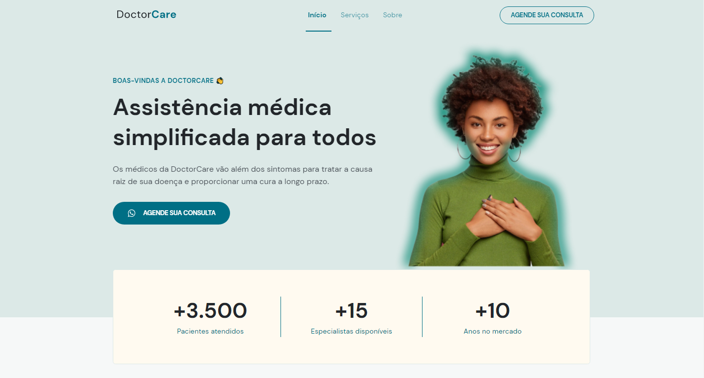
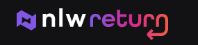

  

  <a href="#-tecnologias">Tecnologias</a>&nbsp;&nbsp;&nbsp;|&nbsp;&nbsp;&nbsp;
  <a href="#-projeto">Projeto</a>&nbsp;&nbsp;&nbsp;|&nbsp;&nbsp;&nbsp;
  <a href="#-layout">Layout</a>&nbsp;&nbsp;&nbsp;|&nbsp;&nbsp;&nbsp;
  <a href="#-layout">Autor</a>&nbsp;&nbsp;&nbsp;|&nbsp;&nbsp;&nbsp;
  <a href="#-licença">Licença</a>

 

  

 

## 🚀 Tecnologias

Esse projeto foi desenvolvido com as seguintes tecnologias e ferramentas:

- [HTML5](https://www.w3schools.com/html/)
- [CSS3](https://www.w3schools.com/css/default.asp)
- [JavaScript](https://www.w3schools.com/js/DEFAULT.asp)
- [Google Fonts](https://fonts.google.com/)
- [ScrollReveal](https://scrollrevealjs.org)

 

## 💻 Projeto

- [Acessar o site do projeto](https://wanderson-a-timoteo.github.io/doctor-care)

DoctorCare é uma página institucional no formato One Page, responsiva, para usar em diversos tipos de micro, pequena e média empresas. Contém as seguintes seções: Header, Navigation, Home, Sobre, Serviços, Depoimentos, Contato e Footer.

### Página Home 

  

### Prévia visualização 

  

 

## 🔖 Layout

Você pode visualizar o layout do projeto através [desse link](https://www.figma.com/community/file/1102912263666619803). É necessário ter conta no [Figma](https://figma.com) para acessá-lo.

 

## 🚩 Tenho Dúvidas... O que fazer?

Caso tenha dúvidas sobre o código do projeto, sintam-se a vontade em abrir uma **[ISSUE AQUI](https://github.com/Wanderson-A-Timoteo/doctor-care/issues)**. Assim que possível, responderei todas as dúvidas!

 

## 💡 Licença

Esse projeto está sob a licença MIT. Veja o arquivo [LICENSE](.github/LICENSE.md) para mais detalhes.

 

## 🎆 Autor

Feito com ♥ by

-  [**Wanderson A. Timóteo**](https://wanderson.tk)

 

## 🤝 Agradecimentos

  

  

- Projeto desenvolvido durante a Next Level Week #8 Return, promovido pela [Rocketseat](https://app.rocketseat.com.br/).

- Agradecimento ao [Mayk Brito](https://instagram.com/maykbrito) por compartilhar conteúdo relevante e com qualidade de ensino.
